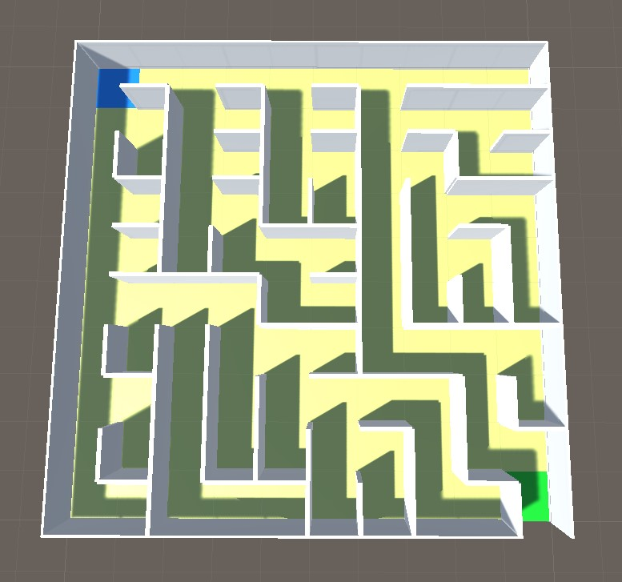

# Maze-Generation
Original [repository](https://github.com/kfkok/Maze-Generation) by @kfkok.

Maze generation using Depth First Backtracking

Maze generation using Binary Tree Algorithm

## Comparison between Recursive Backtracker Algorithm (RBA) and Binary Tree Algorithm (BTA)

| Algorithm | RBA  | BTA  |
|-----------|------|------|
| Trial 1   | 3.53 | 3.55 |
| Trial 2   | 3.76 | 3.50 |
| Trial 3   | 3.56 | 3.51 |
| Average   | 3.62 | 3.52 |

BTA is slightly faster in the tests compared to RBA. The advantages of BTA is that it is very easy to understand and it does keep maze in memory. However, the maze generated by BTA is not complex and the starting and ending positions are fixed in every run.